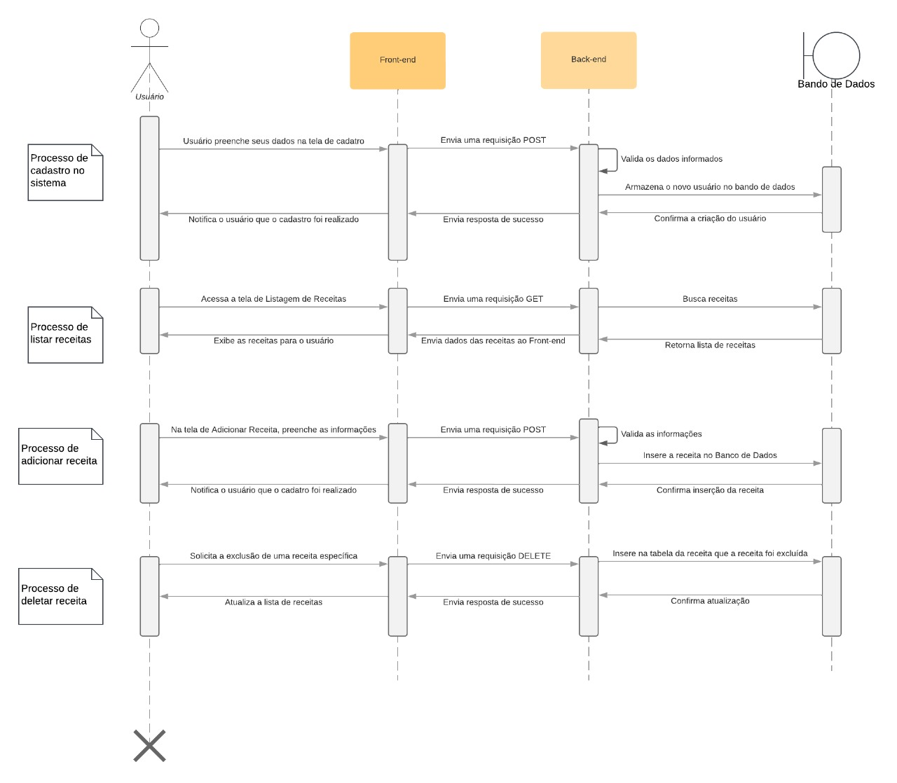
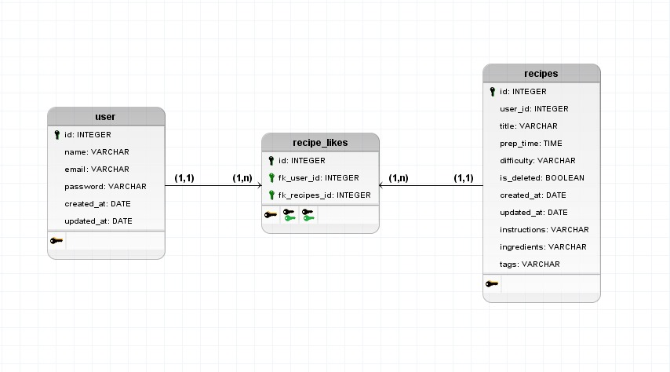
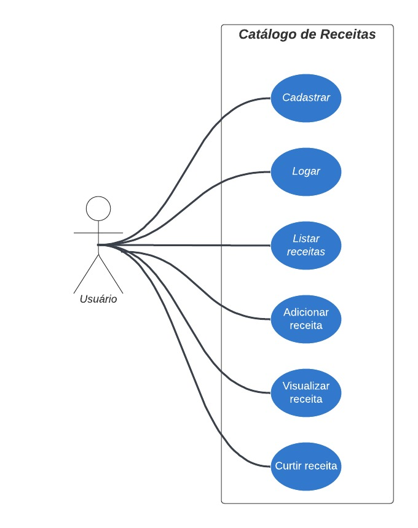

# Catálogo de Receitas com Autenticação

Este projeto é um catálogo de receitas com autenticação, desenvolvido utilizando as tecnologias NestJS para o backend e React com Vite para o frontend.

## Estrutura do Projeto
backend/
    .env
    .eslintrc.js
    .gitignore
    .prettierrc
    client.http
    nest-cli.json
    package.json
    prisma/
        migrations/
        schema.prisma
    private_key.pem
    public_key.pem
    README.md
    src/
        app.controller.ts
        app.module.ts
        app.service.ts
        auth/
        aws/
        commom/
        enum/
        env.ts
        main.ts
        ...
    test/
    tsconfig.build.json
    tsconfig.json
frontend/
    .eslintrc.cjs
    .gitignore
    index.html
    package.json
    README.md
    src/
    tsconfig.app.json
    tsconfig.json
    tsconfig.node.json
    vite.config.ts
README.md


## Tecnologias Utilizadas

### Backend
- [NestJS](https://nestjs.com/)
- [Prisma](https://www.prisma.io/)
- [PostgreSQL](https://www.postgresql.org/)
- [JWT](https://jwt.io/)
- [Bcrypt](https://www.npmjs.com/package/bcryptjs/)
- [AWS SDK](https://aws.amazon.com/sdk-for-javascript/)
- [R2 Cloudflare](https://www.cloudflare.com/pt-br/)

### Frontend
- [React](https://reactjs.org/)
- [Vite](https://vitejs.dev/)
- [Axios](https://axios-http.com/ptbr/)
- [React Hook Form](https://react-hook-form.com/)
- [Zod](https://zod.dev/)
- [Styled Components](https://styled-components.com/)
- [React Router](https://reactrouter.com/)
- [React Toastify](https://fkhadra.github.io/react-toastify/)
- [Radix](https://www.radix-ui.com/)
- [Phosphor Icons](https://phosphoricons.com/)

## Configuração do Projeto

### Backend

1. Clone o repositório:
    ```bash
    git clone https://github.com/seu-usuario/catalogo-receitas-com-autenticacao.git
    cd catalogo-receitas-com-autenticacao/backend
    ```

2. Instale as dependências:
    ```bash
    npm install
    ```

3. Configure o arquivo `.env` com as variáveis de ambiente necessárias.

4. Execute as migrações do Prisma:
    ```bash
    npx prisma migrate dev
    ```

5. Inicie o servidor:
    ```bash
    npm run start:dev
    ```

### Frontend

1. Navegue até o diretório [`frontend`](frontend ):
    ```bash
    cd ../frontend
    ```

2. Instale as dependências:
    ```bash
    npm install
    ```

3. Inicie o servidor de desenvolvimento:
    ```bash
    npm run dev
    ```

## Scripts Disponíveis

### Backend

- `npm run start`: Inicia o servidor em modo de produção.
- `npm run start:dev`: Inicia o servidor em modo de desenvolvimento.
- `npm run start:debug`: Inicia o servidor em modo de depuração.
- `npm run build`: Compila o projeto.
- `npm run test`: Executa os testes unitários.
- `npm run test:watch`: Executa os testes em modo de observação.
- `npm run test:e2e`: Executa os testes de ponta a ponta.
- `npm run lint`: Executa o linter.
- `npm run format`: Formata o código usando Prettier.

### Frontend

- `npm run dev`: Inicia o servidor de desenvolvimento.
- `npm run build`: Compila o projeto para produção.
- `npm run preview`: Visualiza a aplicação compilada.
- `npm run lint`: Executa o linter.
- `npm run lint:fix`: Corrige automaticamente os problemas encontrados pelo linter.

## Estrutura do Banco de Dados

O banco de dados é gerenciado pelo Prisma e utiliza PostgreSQL. A estrutura do banco de dados inclui tabelas para usuários, receitas e curtidas de receitas, com relacionamentos apropriados entre elas.

## Funcionalidades

- Cadastro e autenticação de usuários.
- Criação, edição e exclusão de receitas.
- Upload de fotos para as receitas.
- Listagem de receitas do usuário.
- Curtir e descurtir receitas.
- Visualização de detalhes das receitas.

## Diagramas

### Diagrama de Sequência


### Diagrama DER


### Diagrama de Caso de Uso


## Contribuição

Contribuições são bem-vindas! Sinta-se à vontade para abrir issues e pull requests.

## Contato

- Autor: [Carlos Eduardo Meints](https://github.com/Meints)
- Email: carloseduardomeints@gmail.com

## Recursos

- [Documentação do NestJS](https://docs.nestjs.com)
- [Documentação do React](https://reactjs.org/docs/getting-started.html)
- [Documentação do Vite](https://vitejs.dev/guide/)
- [Documentação do Prisma](https://www.prisma.io/docs/)
- [Documentação do AWS SDK](https://docs.aws.amazon.com/sdk-for-javascript/v2/developer-guide/welcome.html)

## Agradecimentos

Agradecemos a todos os contribuidores e mantenedores das bibliotecas e ferramentas utilizadas neste projeto.